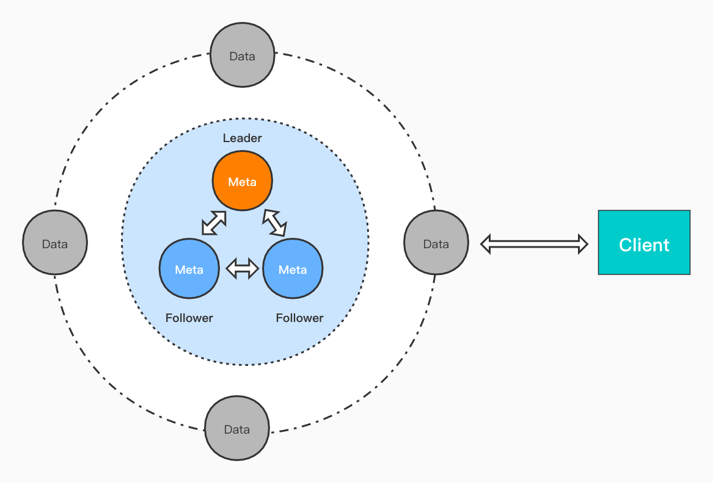

# Chronus

Chronus is an opensourced version of implementation follow the
design of official influxdb-cluster.
It's free and compatible with original influxdb.

## Features

- Compatible with influxql
- High availability
- Scalable online
- Eventual consistent
- Parallel computation
- No other infrastructure needed

## Architecture



### Meta Server

Keep the meta data including shards and its group, continuous
queries, data nodes, etc. .

High availability of meta cluster is achieved through RAFT
(from etcd). So at least 3 meta servers are recommended. And
any odd number greater than one should work but the more the
poorer writing performance. So 3 or 5 is recommended finally.

Meta server cluster can be managed through command line tool
`metad-ctl` in `cmd/metad-ctl`.

### Data Server

Data servers hold the data of shards, run continuous queries
(when aquired lock), accept queries of client and do inner
remote joins if necessary.

Shards are managed by shard groups in logical and each shard
will be guaranteed to be owned by specified `replica` count of
data servers. Group is used to make writes distributed.

## Compile

```shell
cd cmd/influxd && go build && cd -
cd cmd/influxd-ctl && go build && cd -
cd cmd/metad && go build && cd -
cd cmd/metad-ctl && go build && cd -
```

You would get four binaries (metad, metad-ctl, influxd,
influxd-ctl) if successfully. You can put them into PATH or
package them into private repository.

## Boot Meta Cluster

### Configuration

Sample configuration can be reached by executing `metad -sample`.
You should pay attention to following items:

- my-addr: in ip:port format which will be used in cluster's communication between nodes
- raft-id: should be a positive, unique number
- wal-dir: where the meta data stores in
- log-dir: where the logs store in. Logs will be splitted automatically and if you leave
it blank, standard output would be used
- log-level: in production `warn` is recommended

### Boot First Meta Node

Start with sample configuation:

```shell
metad -sample > metad.conf
metad -config metad.conf
```

Then a single node meta cluster is done.

### Check Meta Cluster Status

Using:

```shell
metad-ctl -s ip:port status
```

You can specify any **alive** address in cluster by `-s ip:port` and it's
always required to call `metad-ctl`.

### Add More Meta Nodes to Existed Cluster

You can add more nodes into cluster through two phases:

1. Add node through `metad-ctl add` before boot up new node actually
2. Boot up the node with correct configuration, thus, correct `raft-id` / `my-addr`
3. [CHECK]Always check the cluster status and make sure everything as your expected.

Please add ONLY one node at a time.

> You can also boot up the cluster initially with configured `peers` altogether.
> Set peers expected, boot them up.

```text
Sample peers format:
peers=[
    {addr="127.0.0.1:2345", raft-id=1},
    {addr="127.0.0.1:2346", raft-id=2},
    {addr="127.0.0.1:2347", raft-id=3},
]
```

## Boot Data Cluster

You can use following commands to generate sample configuration of data node.

```shell
influxd config > data.conf
```

You may mainly care about following configurations:

- bind-address: TCP address of data node.
- meta.dir: Directory holds meta data. Absolute path is recommended.
- data.dir: Directory holds data. Absolute path is recommended.
- data.wal-dir: Directory holds wal data. Absolute path is recommended.
- coordinator.pool-max-streams-per-node: Max streams allowed to single data node when
forwarding quries internally. You can adjust it according to your load.
- coordinator.meta-services: [Important]Addresses of meta nodes.
- http.bind-address: Query service listening address which is also called `HTTP Address`.
- http.access-log-path: File holds access log. It will be rotated automatically. Leave it
empty to disable.
- logging.format: `console`(`auto`) / `json` / `logfmt`
- logging.level: `debug` / `info` / `warn` / `fatal`
- continuous_queries.run-interval: Interval of running continuous queries.
- hinted-handoff.{enabled, dir}: If you want to use hh service you should set both of them.
- hinted-handoff.retry-concurrency: If you want to constraint the max requests retrying. Or
unlimited retrying may exhaust the connection pool quickly.
- controller.max_shard_copy_tasks: Max concurrency of active copying task on node.

You can start the data node using:

```shell
influxd run -config data.conf
```

or you want all the logs write into a directory instead of standard output:

```shell
influxd run -config data.conf -logdir /dir/to/write
```

You can repeat to add more data nodes and check the node list using:

```shell
influxd-ctl -s ip:port node list
```

Where `ip:port` is the TCP address of any node in data node cluster.

## Query

Data cluster is compatible with `influx` command line tool and any other clients.
Pay attention to the following rules:

- All data nodes can be quried equivalently.
- Append only.
- Carefully set retention policies.

## License

Chronus is under the MIT license. See the [LICENSE](LICENSE) file for details.

## Contact


